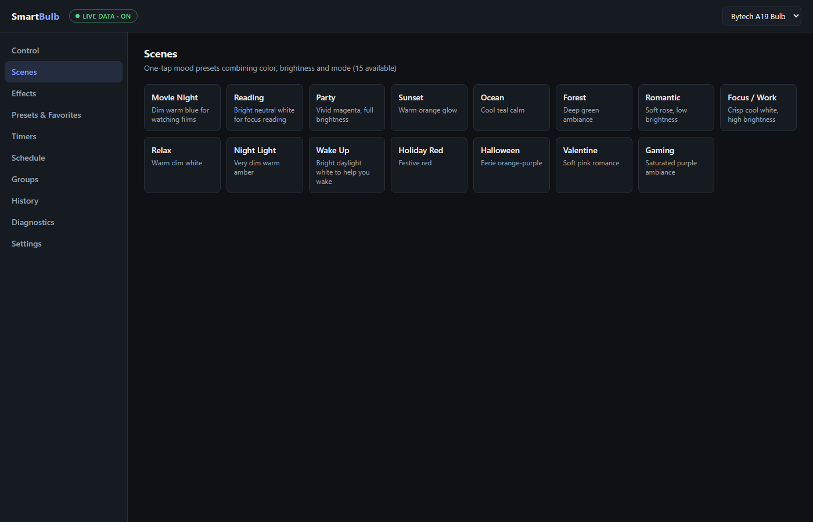
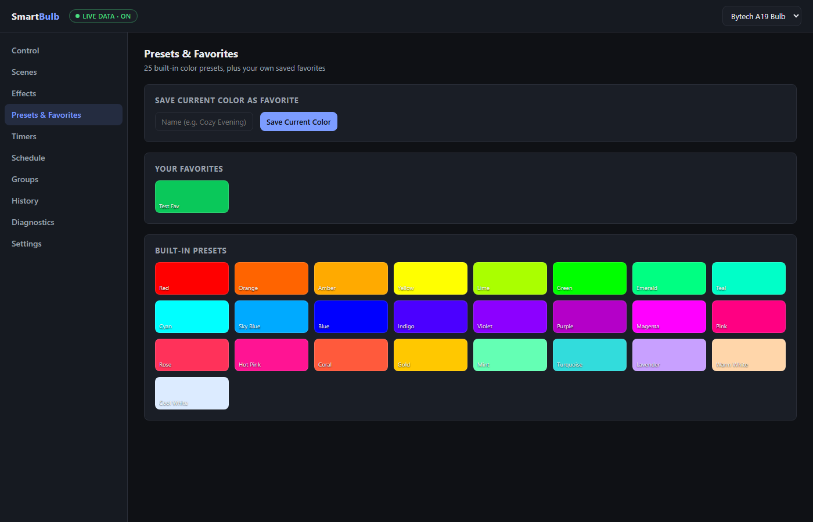

# Smart Bulb Dashboard

A local, cloud-independent dashboard for controlling Tuya-based smart bulbs
(Wi-Fi RGB+CCT bulbs sold under many brands — Bytech, Merkury, Feit, Teckin,
Govee's Tuya-based line, etc). Built as a prototype after reverse-engineering
local control of a Bytech A19 bulb — see `HANDOFF.md` for the full story of
how the device credentials were obtained.

Everything talks to the bulb directly over your LAN via [tinytuya](https://github.com/jasonacox/tinytuya).
No cloud round-trip for day-to-day control.

> **Repo:** GitHub → [`THEROCKSSS/smart-bulb-dashboard`](https://github.com/THEROCKSSS/smart-bulb-dashboard) (public).
> Licensed **noncommercial** — see [License](#license).


## What's here

- **137 working features** — see `FEATURES.md` for the full itemized list
  (power/brightness/color control, 25 color presets, 15 mood scenes, 7
  animated effects, sleep/wake timers, a recurring schedule engine,
  multi-bulb groups, history, diagnostics, and more).
- **12 audio-reactive lighting modes** with sub-15ms decision latency and
  multi-bulb orchestration (unison/chase/band-split) — see
  `docs/music-reactive-lighting.md`.
- **Network auto-discovery** (weekly or on-demand LAN scanning) — see
  `docs/network-discovery.md`.
- **A PIN-gated remote-access path** for reaching the dashboard safely
  from outside your LAN (Tailscale recommended, DuckDNS+PIN as the public
  alternative) — see `docs/remote-access-security.md`.
- A FastAPI backend (`backend/`) exposing a 55+-route REST API.
- A vanilla-JS dark-themed dashboard (`frontend/`) — no build step, no
  framework.
- Project-local Claude Code skills (`.claude/skills/`) that teach an agent
  how to set this up and drive it. **If you're an AI agent, read
  `AGENTS.md` first.**
- A **month-long, ~1000-item roadmap** (`roadmap/`) for planned future
  work, phased across 4 weeks with a dependency graph.
- A live GitHub Pages site (once enabled) mirroring these docs for easier
  browsing.

## Quickstart

```bash
cd backend
python -m venv venv
./venv/Scripts/activate   # or source venv/bin/activate on Linux/Mac
pip install -r requirements.txt
cp config.example.json config.json
# edit config.json with your bulb's device_id, local_key, and ip — see SETUP.md
python -m uvicorn main:app --host 0.0.0.0 --port 8500
```

Then open **http://localhost:8500**.

Full step-by-step instructions, including how to obtain your bulb's
`device_id` and `local_key` (the hard part), are in **SETUP.md**.

## Docs

| File | What it covers |
|---|---|
| `SETUP.md` | Step-by-step setup from zero, including getting Tuya credentials |
| `API.md` | Full REST API reference with curl examples |
| `FEATURES.md` | Every implemented feature, itemized (137 total) |
| `ROADMAP.md` | Near-term planned work and what's deliberately not built yet |
| `roadmap/` | The month-long, ~1000-item phased backlog with a dependency graph |
| `docs/music-reactive-lighting.md` | The 12 audio-reactive modes, latency/dwell design, orchestration |
| `docs/network-discovery.md` | Auto-scan and manual network discovery |
| `docs/remote-access-security.md` | Tailscale vs. DuckDNS+PIN gate, threat model |
| `HANDOFF.md` | How this was built, verified, and what's known-fragile |
| `iterations/` | Real build-test-fix logs — what broke and how it was fixed, round by round |
| `AGENTS.md` | Start here if you're an AI agent picking this repo up cold |

## Screenshots

| Scenes | Presets |
|---|---|
|  |  |

## Multi-bulb ready

Only one physical bulb exists today, but the config format
(`backend/config.example.json`) is already a list, and there's a working
`groups` feature (broadcast power/color to a set of device IDs). Adding a
second bulb later is: add an entry to `config.json`, restart, done — no code
changes. Multi-bulb audio orchestration (unison/chase/band-split roles) is
already built and tested against fake controllers plus the real API with a
1-bulb group — real multi-bulb visual testing is the first thing to do
once a second bulb is purchased (see `ROADMAP.md`).

## Security note

`backend/config.json` holds your bulb's `local_key` in plaintext (that's
what Tuya's local protocol requires). It's git-ignored and never leaves your
network — the dashboard redacts it in every API response. Don't commit your
real `config.json`; use `config.example.json` as the template.

## License

Released under the **Polyform Noncommercial License 1.0.0** — see
[`LICENSE`](LICENSE). Personal, study, and contribution use is free and
welcome. **Commercial use (selling it, offering it as a paid service, or
building a paid product on top of it) is NOT permitted** without a separate
commercial license from the author. See the LICENSE file for how to inquire
about commercial terms.
