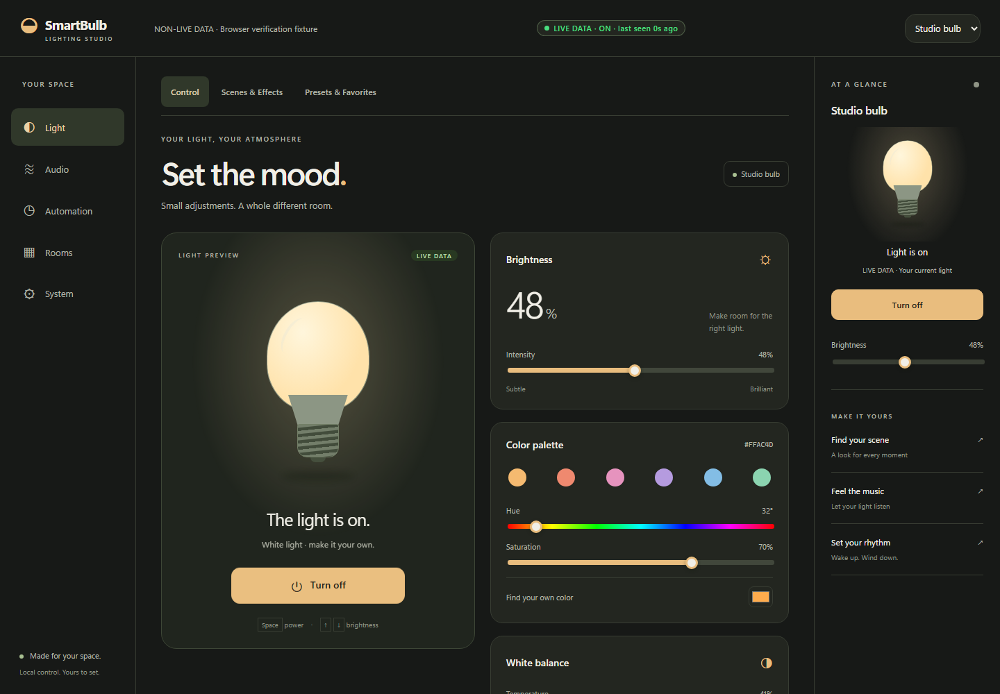

# Smart Bulb Dashboard

A local, cloud-independent dashboard for controlling Tuya-based smart
bulbs (Wi-Fi RGB+CCT bulbs sold under many brands — Bytech, Merkury, Feit,
Teckin, Govee's Tuya-based line, and more). Everything talks to the bulb
directly over your LAN via [tinytuya](https://github.com/jasonacox/tinytuya)
— no cloud round-trip for day-to-day control.

**Repo:** [`THEROCKSSS/smart-bulb-dashboard`](https://github.com/THEROCKSSS/smart-bulb-dashboard) (public, noncommercial license)



## What's here

- **137 working, tested features** — power/brightness/color control, 25
  color presets, 15 mood scenes, 7 animated effects, sleep/wake timers, a
  recurring schedule engine, multi-bulb groups, history, diagnostics, and
  more. See the [full feature list](FEATURES.html).
- **12 audio-reactive lighting modes** — the bulb reacts to music/audio in
  real time (from your PC via VoiceMeeter, or a real microphone), with
  sub-15ms decision latency and a tunable "how long each color stays
  visible" dial. See [Audio-Reactive Lighting](docs/music-reactive-lighting.html).
- **Multi-bulb orchestration** — unison, chase (phase-offset), and
  per-bulb band-split roles, sharing one audio analysis across a whole
  group.
- **Network auto-discovery** — weekly (or on-demand) LAN scanning for new
  Tuya devices. See [Network Discovery](docs/network-discovery.html).
- **A PIN-gated remote-access path** for safely reaching the dashboard
  from outside your home network. See [Remote Access & Security](docs/remote-access-security.html).
- A FastAPI backend (49+ routes) and a vanilla-JS dark-themed frontend —
  no build step, no framework.

## Quick start

```bash
git clone https://github.com/THEROCKSSS/smart-bulb-dashboard
cd smart-bulb-dashboard/backend
python -m venv venv
./venv/Scripts/activate   # or: source venv/bin/activate
pip install -r requirements.txt
cp config.example.json config.json   # then fill in your bulb's device_id/local_key/ip
python -m uvicorn main:app --host 0.0.0.0 --port 8500
```

Open `http://localhost:8500`. Full step-by-step instructions, including
how to actually obtain your bulb's `device_id`/`local_key` (the one
genuinely tricky part), are in the [Setup Guide](SETUP.html).

## If you're an AI agent

Read [`AGENTS.md`](AGENTS.html) first — it's written specifically for an
agent picking this project up cold, with pointers to every skill file and
the pitfalls already found the hard way during development.

## Documentation index

- [Setup Guide](SETUP.html) — full walkthrough, all 3 ways to get a bulb's local key, Docker instructions, troubleshooting
- [Feature List](FEATURES.html) — every one of the 137 working features, itemized
- [API Reference](API.html) — full curl reference for every endpoint
- [Audio-Reactive Lighting](docs/music-reactive-lighting.html) — all 12 modes, latency/dwell design, orchestration
- [Network Discovery](docs/network-discovery.html) — auto-scan and manual discovery
- [Remote Access & Security](docs/remote-access-security.html) — Tailscale (recommended) vs. DuckDNS+PIN gate, threat model
- [Month-Long Roadmap](roadmap/README.html) — 1000 planned items across 4 weekly phases, with a dependency graph
- [Handoff / Build History](HANDOFF.html) — the real story of how this was built, round by round

## Build process, warts and all

This project's [`iterations/`](https://github.com/THEROCKSSS/smart-bulb-dashboard/tree/master/iterations)
directory documents every real bug found during development and how it
was fixed — a blocking-I/O bug that froze audio analysis, a circular
hue-smoothing bug, a PIN-gate root-path lockout bug, and more. It's kept
deliberately unpolished because the point is to show what actually broke
and got fixed, not just the finished result.

## License

Noncommercial — personal and contribution use is free; commercial use
requires a separate license from the author. See the repo's `LICENSE`
file for full terms.
