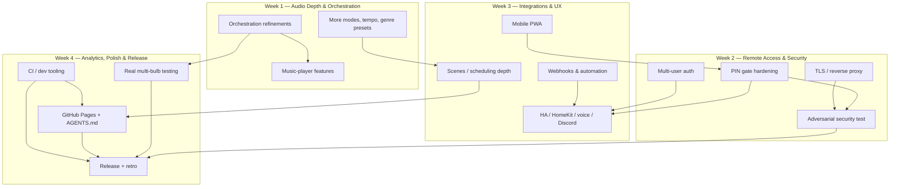

# Month-Long Roadmap — 1000 Ideas Across 4 Weekly Phases

This is the planning artifact requested for a month-long, multi-PR/issue
work cycle on this project. It's organized as four weekly phase files,
each with ~250 issue-ready items grouped into themed sections. Nothing
here is committed to code — it's a backlog to draw from, review, edit, and
convert into real GitHub issues at whatever pace makes sense.

- [`week-1-audio-and-orchestration.md`](week-1-audio-and-orchestration.md) — deepens the v2 audio engine and multi-bulb orchestration built this session
- [`week-2-remote-access-and-security.md`](week-2-remote-access-and-security.md) — hardens the PIN gate, adds TLS, and includes the dedicated adversarial security-test phase
- [`week-3-integrations-and-ux.md`](week-3-integrations-and-ux.md) — Home Assistant/HomeKit/voice/Discord integrations, scenes/scheduling depth, mobile UX
- [`week-4-analytics-polish-and-release.md`](week-4-analytics-polish-and-release.md) — analytics, Bluetooth-readiness, GitHub Pages, agent onboarding, dev tooling, and a real month-end retro

Each item is numbered with a phase-scoped ID (`W1-001`, `W2-047`, etc.) —
use that ID plus the item text as a GitHub issue title, e.g.:

> **[W1-042] Manual "tap tempo" input as a fallback/override for BPM estimation**

## How this maps to GitHub issues/PRs

1. **Don't create all ~1000 issues at once.** Convert a week's worth (or
   less) at a time as work actually begins on it — a backlog of 1000 open
   issues is unmanageable and issue-tracker noise, not planning. This
   file's job is to be a ready reference, not a queue that must be
   materialized in full.
2. **One issue per item** (or per small cluster of closely related items
   within a numbered sub-section) is the intended granularity — most items
   here are already sized like a single, reviewable PR.
3. **Label scheme**: `week-1` / `week-2` / `week-3` / `week-4` plus a
   theme label matching each file's numbered sections (e.g. `audio`,
   `security`, `orchestration`, `integrations`). Use GitHub Milestones for
   the four weeks so progress is trackable at a glance.
4. **PRs reference their issue** in the description and, per this
   project's own established convention, get an `iterations/NNN-slug/`
   write-up if the work involved a real build-test-fix cycle (see
   `iterations/README.md`) — not required for pure documentation-only
   items.
5. **Security items (Week 2, section 5 especially)** should not be closed
   on "code written" — they need the actual verification described in the
   item (a real test against a real deployed instance where applicable),
   mirroring how `iterations/004-pin-gate-remote-auth/` was verified this
   session, not just implemented.

## Dependency graph

Not every item depends on every other, but the four weeks build on each
other roughly in this order, and a few cross-cutting dependencies matter
enough to call out explicitly:

Read this as: the security-test phase (W2C) can't meaningfully start until
both TLS (W2A) and PIN-gate hardening (W2B) are in place — attacking a
half-built defense wastes the exercise. Integrations (W3A) lean on the
PIN gate and multi-user work from Week 2 being reasonably settled, since
several integrations (webhooks, Discord) need a stable auth story to sit
behind. Real multi-bulb testing (W4C) is gated on Week 1's orchestration
work actually existing to test. Everything converges on Week 4's release
+ retro (W4D), which is deliberately the last node — it's the checkpoint
that confirms the month's work is real, not just written down.

## Scale and honesty notes

- ~1000 items exist here because that's what was asked for, split across
  4 weeks/~250 each so no single file is unmanageable. That is **not** the
  same as a commitment that 1000 items will actually ship in a month — the
  point of a backlog this size is optionality and reference depth, not a
  guarantee. Expect real velocity to convert a fraction of this into
  actual merged work per week, same as any real backlog.
- Several items explicitly say "evaluate" or "decide" rather than "build"
  — some of this month's value is in explicitly *not* building things that
  don't turn out to be worth it (see Week 2's multi-user section and Week
  3's Google/Alexa cloud-dependency tradeoff, both flagged as genuinely
  open questions, not foregone conclusions).
- The adversarial security-test phase (Week 2, section 5) and real
  multi-bulb testing (Week 4, section 5) both explicitly require real
  infrastructure/hardware that doesn't exist yet at the time this roadmap
  was written — they're sequenced late in the month for exactly that
  reason, not because they're less important.
